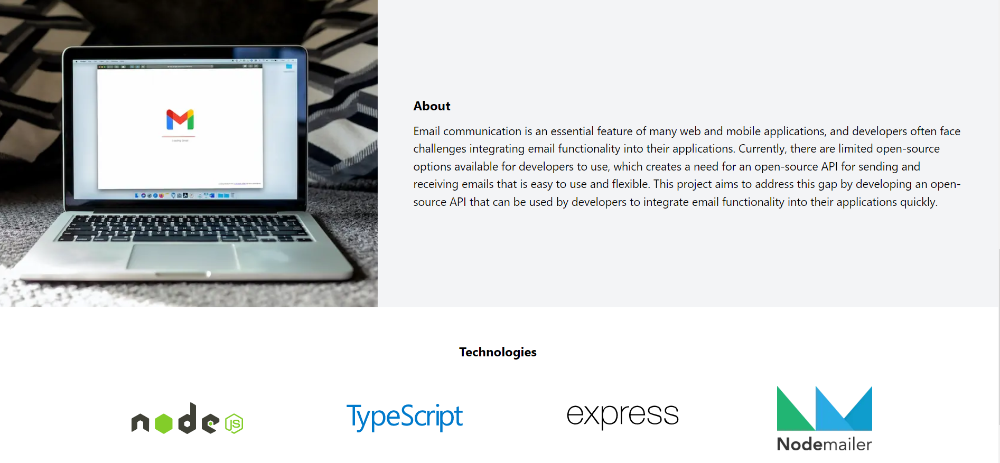

<div align="center" id="top"> 
  

&#xa0;

<a href="https://everythingmail.onrender.com">API Demo</a>

</div>

<h1 align="center">Everythingmail API </h1>

<p align="center">
  

  

  <!--  -->

  

  

  

  
</p>

<!-- Status -->

<h4 align="center"> 
	🚧  Everythingmail 🚀 Under construction...  🚧
</h4>

<hr>

<p align="center">
  <a href="#dart-about">About</a> &#xa0; | &#xa0; 
  <a href="#sparkles-objectives">Objectives</a> &#xa0; | &#xa0;
  <a href="#rocket-technologies">Technologies</a> &#xa0; | &#xa0;
  <a href="#white_check_mark-requirements">Requirements</a> &#xa0; | &#xa0;
  <a href="#checkered_flag-starting">Starting</a> &#xa0; | &#xa0;
  <!-- <a href="#memo-license">License</a> &#xa0; | &#xa0; -->
  <a href="##memo-contributors" target="_blank">Contributors</a>
</p>

<br>

## :dart: About

Email communication is an essential feature of many web and mobile applications, and developers often face challenges integrating email functionality into their applications. Currently, there are limited open-source options available for developers to use, which creates a need for an open-source API for sending and receiving emails that is easy to use and flexible. This project aims to address this gap by developing an open-source API that can be used by developers to integrate email functionality into their applications quickly.

**Case Study:**

Consider a case where a web developer is building an e-commerce platform that requires email notifications for order confirmation, order updates, and other customer-related communication. The developer can either develop a custom email sending solution or use an existing email service provider like Gmail, SendGrid, or MailChimp. However, custom solutions can be time-consuming to develop, while existing email service providers may have limitations in terms of customization, security, or cost.

By using our open-source email sending server API, the developer can easily integrate email functionality into their e-commerce platform with minimal effort. The API provides a simple and customizable solution that can be tailored to meet the specific needs of the project. Moreover, the use of TypeScript ensures that the code is robust and easy to maintain, while Nodemailer provides a reliable and secure email sending service.

## :sparkles: Objectives

Objective
The objective of this project is to develop an open-source email sending server API using Nodemailer and TypeScript that simplifies the process of integrating email functionality into web and mobile applications. The API should provide developers with a customizable, secure, and reliable solution for sending emails, without requiring extensive technical knowledge or experience. The project aims to foster a collaborative community of developers who can contribute to and benefit from the project, ensuring that the API remains up-to-date, secure, and adaptable to the evolving needs of the developer community. Ultimately, the objective is to improve the overall user experience for applications that require email functionality, making it easier and more convenient for developers to add email capabilities to their projects.
The following are some of the features that the open-source API for sending and receiving emails should have:

1. **Customizable**: The API should provide developers with the ability to customize various aspects of the email sending process, including email content, attachments, and sender/receiver details.
2. **Secure**: The API should implement industry-standard security measures to ensure that email data is protected during transit and at rest.
3. **Reliable**: The API should be robust and able to handle high volumes of email traffic, with minimal downtime or errors.
4. **Easy to use**: The API should be user-friendly, with clear documentation and easy-to-understand code.
5. **Adaptable**: The API should be adaptable to different programming languages and frameworks, enabling developers to use it in a wide range of projects.

## :checkered_flag: Starting

```javascript
// the data this endpoint takes

type MailData = {
  receiver_email: string,
  sender_email?: string | undefined,
  sender_identity?: string | undefined,
  subject: string,
  message: string,
  noreply?: boolean,
};
```

### USING AXIOS

```javascript

// the data this endpoint takes

try {
  const { data } = await axios({
    method: "POST",
    url: "https://everythingmail.onrender.com/api/send"
    data: mailData,
    headers: { "Content-Type": "application/json" },
  });
    console.log(data);
} catch (error) {

  console.log(error);
}
```

### USING JAavaScript FETCH API

```bash
    try {
      const response = await fetch("https://everythingmail.onrender.com/api/send", {
        method: "POST",
        headers: { "Content-Type": "application/json" },
        body: JSON.stringify(mailData),
      });
      const data = await response.json();

    } catch (error) {
      console.log(error);
    }
```

**Sample Use Case**
    
```javascript 
    const mailData = {
      receiver_email: formData.copy ? [ADMIN_EMAIL, formData.email] : ADMIN_EMAIL,
      sender_email: formData.email,
      sender_identity: formData.name,
      subject: "EverythingMail Demo Test",
      message,
      noreply: true,
    };
    try {
      const { data } = await Axios({
        method: "POST",
        data: mailData,
        headers: { "Content-Type": "application/json" },
      });
      if (data?.success) {
        toast.success("Email sent successfully");
      } else {
        toast.error("Sorry something went wrong");
      }
      setLoading(false);
    } catch (error) {
      setLoading(false);

      let message =
        error?.response?.data?.message || error.code == "ERR_NETWORK"
          ? "Network Error"
          : "Sorry something went wrong";
      toast.error(message);
      // console.log(message);
      console.log(error);
    }
```

## :rocket: Technologies

The following tools were used in this project:

- [Node.js](https://nodejs.org/en/)
- [TypeScript](https://www.typescriptlang.org/)
- [Express](https://expressjs.com/)
- [Nodemailer](https://nodemailer.com/about/)

## :white_check_mark: Requirements

All you need as a requirement is the API URL and a clear understanding of the various endpoints as well as the data the endpoint requires.

## :memo: Contributors

These wonderful people have contributed to this project:

<!-- readme: contributors -start -->
<table>
<tr>
    <td align="center">
        <a href="https://github.com/qbentil">
            
            <br />
            <sub><b>Bentil Shadrack</b></sub>
        </a>
    </td>
    <td align="center">
        <a href="https://github.com/baabashinelle">
            
            <br />
            <sub><b>Baaba Dampare</b></sub>
        </a>
    </td>
    <td align="center">
        <a href="https://github.com/Derelmi">
            
            <br />
            <sub><b>RICHARD CHUKWU DERELMI</b></sub>
        </a>
    </td></tr>
</table>
<!-- readme: contributors -end -->

This project follows the [all-contributors]() specification. Contributions of any kind are welcome!
You are welcome to contribute to this project.

Please read the [CONTIBUTING.md](./CONTRIBUTING.md) file for details on our code of conduct, and the process for submitting pull requests to us.

&#xa0;

<a href="#top">Back to top</a>
